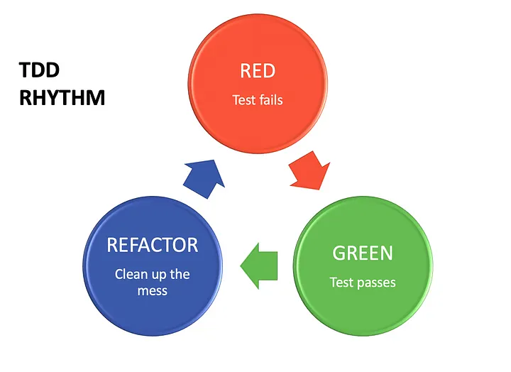

# Welcome to unit testing in flutter  


###### Table of content
1. [Test Driven Development](#test-driven-development-tdd-cycle)
    a. [red](#-1-red--write-a-failing-test)
    b. [green](#-2-green--make-the-test-pass)
    c. [refactor](#️-3-refactor--clean-the-code)
2. [Design Structure of a Unit test](#design-structure-of-a-unit-test)
3. [Design pattern of a Unit test](#design-pattern-of-a-unit-test)
4. [Arrange Act Assert The (AAA) Pattern](#arrangeactassert-aaa-pattern)
    a. [Arrange](#-1-arrange)
    b. [Act](#-2-act)
    c. [Assert](#-3-assert)
5. [Test case Example](#test-case-example)


**`Lets first learn the about 2 core concepts of all testing`**

> You don't need to focus on the code samples of this section.We will get into it later.

### Test-Driven Development (TDD) Cycle



> A *red-green-refactor* workflow for writing reliable, maintainable, and test-first code.

>For most developers, it’s not something that comes naturally and the hardest part is to get used to it. But the good news is that the process of TDD is rhythmic, and because of that, I will try to show you by example how easy it is when you feel the rhythm. Basically, through all your work you need to repeat 3 steps/colors:

---

#### 🔴 1. RED – Write a Failing Test

📌 **Goal:** Define what the code *should do* — **before** writing the implementation.

- ✍️ Write a unit test for a feature or behavior you want to implement.
- ❌ The test **must fail** initially (since the feature doesn't exist yet).
- 🧠 This step **clarifies the requirement** and gives a reason to write only what’s needed.
---
**Example:**

```dart
test('should return true when user is logged in', () {
  final auth = AuthService();
  expect(auth.isLoggedIn(), isTrue); // 🔴 Test fails — not yet implemented
});
```
---

#### 🟢 2. GREEN – Make the Test Pass

📌 **Goal:** Write *just enough code* to pass the failing test.

- ✅ Implement the **simplest logic** to satisfy the test.
- 🧩 No optimizations, no refactoring — just **make it work**.
- 🔐 Avoid over engineering; keep the solution **minimal and focused**.

---

**Example:**

```dart
class AuthService {
  bool isLoggedIn() => true; // 🟢 Hardcoded to pass the test
}
```

#### 🛠️ 3. REFACTOR – Clean the Code

📌 **Goal:** Improve the internal structure **without changing the behavior** or breaking any tests.

- 🔄 Refactor logic, variable names, structure, or remove duplication.
- 🧼 Focus on **readability**, **maintainability**, and **flexibility**.
- ✅ All tests **must remain green** — no functional changes.

---

**Example:**

```dart
class AuthService {
  bool _loggedIn = true;

  bool isLoggedIn() => _loggedIn; // 🛠️ Cleaner, flexible for future logic
}
```
---
> **Please keep this im mind**
> If you have opened your project and you began with anything else instead of creating a test file, stop there! 
Before implementing anything, we will write the test cases. Remember, Red-Green-Refactor.

---

### Design Structure of a Unit test

> Based on the implementation you can design you test cases in folders as you need it.

```bash
test/
├── core/
│   ├── utils/
│   │   └── date_helper_test.dart
│   └── services/
│       └── logger_service_test.dart
│
├── shared/
│   └── models/
│       └── user_model_test.dart
│
├── modules/
│   ├── auth/
│       ├── application/
│       │   └── login_use_case_test.dart
│       ├── domain/
│       │   └── auth_validator_test.dart
│       └── presentation/
│           └── login_controller_test.dart
│
├── widgets/
│   └── custom_button_test.dart
│
└── main_test.dart

```

---

### Design pattern of a Unit test

> Always remember every `<test_file_name>.dart` test file follows the same structure

```dart
void main(){
    // Define your test cased....
}
```

Generally you can have **two types** of test cases in terms of **how you are writing them**.
1. Independent test case
2. A test case `GROUP` that contains multiple test cases

```dart
import 'package:flutter_test/flutter_test.dart';

void main() {

  // Independent case
  test(
    'description of the test case',
    () {
        // Code for your test
    },
  );

  // Group test cases
  group(
    'description of the test GROUP',
    () {
      test(
        'description of the test case 1 of this group',
        () {
            // Code for your test
        },
      );

      test(
        'description of the test case 2 of this group',
        () {
            // Code for your test
        },
      );

      test(
        'description of the test case 3 of this group',
        () {
            // Code for your test
        },
      );
    },
  );
}

```

**When to use which?**
> Generally for testing a **Class, Controller, Service** wright them in a group which gives you a compact segemnt to run only that part that you are currently working on at once and in sequence. 

> For stand alone functions you can go with Independent test case

---


### Arrange–Act–Assert (AAA) Pattern
> Now lets talk about how the arrangement works. We will focus on cases and use for flutter but its a standard structure. **Please focus on the implementation example from this point**
---
#### 📦 1. Arrange

📌 **Goal:** Set up the test data and environment.

> Define the variables and class you need in the way you need it. Based on requirement you may need 2 types of setup.

1. **Data that maintain their state**
    > Generally let's think in this [structure](#design-pattern-of-a-unit-test) mentioned in the top, what can we do so that a variable holds it's state? 

    > Well if we directly store something inside the main function as a variable? wont all of the function bellow have access to that? and wont all changes made to it reflect on each test cases when accessed? 

    > Well thats the general concept and true for our case as well 

    **Example:**
    ```dart
    void main(){
        // Any thing defined here will maintain state 
        // as its just a function and we are calling other 
        // functions form inside the main function here!

        int targetCount = 0;
        String name = '';
        List<Object> dynamicList = [];

        // Please note that you can have references and objects
        // from your custom classes here as well
    }
    ```


2. **Data that refresh just before every test function is called**

    > Before going into how we set this up. Let's know why we need it? 

    > Well, in flutter app development we have seen 
    >- Classes with varying init setup using constructors
    >- To check how null is handled
    >- To check a functions behavior if some other parm is in their init state with in the class or controller and much more ...

    > For all this cases and more we need to have a `fresh instance` of our variables or class instances. So to reduce the hassle of clearing or reinitialize it every time in code. We set it up like this.. using the **setUp()** function

    > It's same as calling init of a Stateful widget or calling onInit() in Get Controller..

    **Example:**
    ```dart
    void main(){
        
        // SET UP FOR LATE INIT
        // So that all the functions bellow have access to your variables
        late Counter counter;
        late DateTime dateTime;

        // THEN USE THE setUp function to assign the value
        // It's same as calling init of a stateful widget 
        // or calling onInit() in Get Controller ..
        // The setUp() runs once before every teat case with in this void main..
        setUp(() {
            dateTime = DateTime.now();
            refreshedCounter = Counter();
        });

        test('description',(){
            int x = 0; // Also possible but not preferred unless strictly required 
        });
    }
    ```    
    #### `🔖Please note that you can set up the Arrange segment in the top or with in a test function as per your need.`
---

#### 🚀 2. Act

📌 **Goal:** Execute the functions or do the required manipulations as per business needs.

>🔖 A quick note, we were declaring the the variables in the [Arrange](#-1-arrange) segment at the top with the main function or in a test function. **But all Act and assert must be with in the test function** 

**Example:**
```dart
void main(){
        
        // Arrange
        late Counter counter;
        setUp(() {
            counter = Counter();
        });

        test('Check increment function', () {
        // ACT
        // Do all the required manipulations here
        counter.incrementCounter();

        // async await calls can be achieved in the simile way 
      });
    }
```
---

#### ✅ 3. Assert

📌 **Goal:** Verify if the outcome matches your expectations and business logic.

>🔖 A quick note, we were declaring the the variables in the [Arrange](#-1-arrange) segment at the top with the main function or in a test function. **But all Act and assert must be with in the test function** 

**Example:**
```dart
void main(){
        
        // Arrange
        late Counter counter;
        setUp(() {
            counter = Counter();
        });

        test('Check increment function', () {
        // ACT
        counter.incrementCounter();

        // ASSERT
        // Target the variables and match the result with expected value

        // If this segment matches .. The test case will pass otherwise an error will be thrown
        expect(counter.count, 1);
      });
    }
```
---


## Test case example
> So now we know what is what, Lets dive in and see how to use our newly gained knowledge

> We will be seeing an test example for a counter class

> Let's start

#### Step 1 : Define the test cases as per business requirements

In our counter class we need check if,
1. It inits properly that means, is the `count == 0`
2. Is it adding 1 to the count when ever the function is called
3. Is it decrementing the count by one on each call
4. When the `count == 0`, if we call decrementCounter it should remain `0`.

---

#### Step 2: Let's make a counter test file as `counter_test.dart` and wright the test cases

> We are implementing the 🔴 Red cases if you remember from our [TDD Life Cycle](#test-driven-development-tdd-cycle)

> 📒 **Please note that you will get a synnex error as you don't have a counter class, Thats the first 🔴 Red** 

```dart
void main() {
  // ARRANGE
  Counter counter = Counter();
  late Counter refreshedCounter;

  setUp(() {
    refreshedCounter = Counter();
  });

  group(
    'testing the counter class',
    () {
      test(
        'Check counter init',
        () {
          // ACT
          // NOT NEEDED FOR THIS CASE

          // ASSERT
          expect(refreshedCounter.count, 0);
        },
      );

      test('Check increment function', () {
        // ACT
        counter.incrementCounter();
        counter.incrementCounter();

        // ASSERT
        expect(counter.count, 2);
      });

      test('Check decrement async function', () async {
        // ACT
        await counter.decrementCountWithDelay();

        // ASSERT
        expect(counter.count, 1);
      });

      test('Check decrement async function if called on init', () async {
        // ACT
        await counter.decrementCountWithDelay();

        // ASSERT
        expect(refreshedCounter.count, 0);
      });
    },
  );
}
```
---
#### Step 3: Run the test and implement 🟢 Green step

> Lets run, check and implement the bear minimum to get all cases passed

**Run In Terminal**
```bash
flutter test test/counter_test.dart
```
**Run in VS Code or Android studio**
> Arrows will be their with the main function, group and test cases. Click and run...

**Create the counter class with required functions**
> As we didn't implement the counter class and left it as the first 🔴 Red mark. Lets fix it.

```dart
class Counter{
    int count = -1;
}
```
> We also need the `incrementCounter` and the `decrementCountWithDelay` functions  as they are called in the test. 

```dart
class Counter {
  int count = -1;

  void incrementCounter() {}

  Future<void> decrementCountWithDelay() async {}
}

```

**Check by calling the test**

> As expected all of out test cases failed
```bash
C:\src\flutter\bin\flutter.bat --no-color test --machine --start-paused test\unit_test.dart
Testing started at 2:45 PM ...

package:matcher                                     expect
package:flutter_test/src/widget_tester.dart 480:18  expect
test\unit_test.dart 83:11                           main.<fn>.<fn>

Expected: <0>
  Actual: <-1>

package:matcher                                     expect
package:flutter_test/src/widget_tester.dart 480:18  expect
test\unit_test.dart 93:9                            main.<fn>.<fn>

Expected: <2>
  Actual: <-1>

package:matcher                                     expect
package:flutter_test/src/widget_tester.dart 480:18  expect
test\unit_test.dart 101:9                           main.<fn>.<fn>

Expected: <1>
  Actual: <-1>

package:matcher                                     expect
package:flutter_test/src/widget_tester.dart 480:18  expect
test\unit_test.dart 109:9                           main.<fn>.<fn>

Expected: <0>
  Actual: <-1>

```
---

**Let's do the bear minimum to get all passed cases**

> Yes this is not out final expected implementation but it is the bear minimum required to get all classes passed

```dart
class Counter {
  int count = 0;

  void incrementCounter() {
    count = 2;
  }

  Future<void> decrementCountWithDelay() async {
    if (count == 0) return;
    count = 1;
  }
}
```


---

**OK, Now its time to refactor the implementation while maintaining all cases at passed state**

```dart
class Counter {
  int count = 0;

  void incrementCounter() {
    // Instead of setting the count to 2 we make the counter go UP ⬆️ 
    count++;
  }

  Future<void> decrementCountWithDelay() async {
    // Adding this 2 second delay to create the async behavior
    await Future.delayed(const Duration(seconds: 2));
    
    // if the counter is in init state re don't decrement the count
    if (count == 0) return;

    // Else we decrement the counter ⬇️
    count--;
  }
}

```
> This will give us all the passed test cases but this time, They should pass genuinely
---